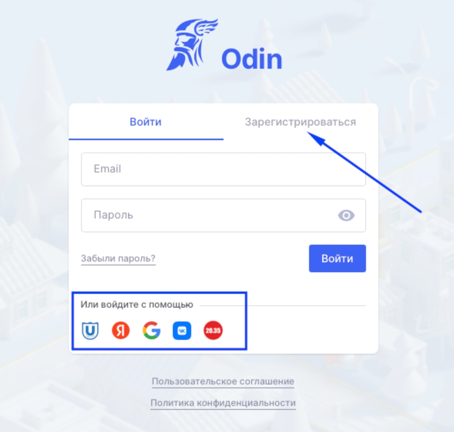

Что такое Odin?

Это образовательная платформа, где вы будете проходить обучение, изучать материалы, выполнять задания и тесты, подключаться к онлайн-звонкам, вести переписку в чатах, получать оценки или баллы, увеличивать прогресс.

К Odin подключены различные образовательные организации, где проводятся образовательные программы, в том числе и ваша.

В рамках каждой программы может быть одна или несколько Дисциплин \[1\], где будут Активности \[2\], в которых вы будете выполнять задания, тесты, изучать материалы и т.д.

Обучение  в рамках дисциплины проводит **Преподаватель**.\
Все, кто обучаются  -  **Студенты**. \
Часто образовательная организация назначает **куратора** для группы студентов.

:::tip 

Про все обновления системы регулярно рассказываем в Telegram-канале [@odin_update ](https://t.me/+JoF696WdDTxlNjhi)\
Если вам интересно, как развивается платформа Odin, подписывайтесь :-)

:::

## Как войти в систему?

[tabs]

[tab:Участники проекта \"Активные меры содействия занятости\"]

За сутки до даты старта для каждого из студентов будет сгенерирован профиль. На почту из заявки придет письмо-приглашение в Odin с инструкцией по установке пароля.

Почта из заявки - логин для входа в Odin. Подробнее о личном кабинете гражданина-участника проекта "Активные меры содействия занятости" [здесь](https://gramax.smile-tech.study/Flow_TSU_GR_help).

**Не регистрируйтесь в Odin заранее!**

При свободной регистрации не будет прикрепление к обучению до даты старта и есть вероятность создать профиль на другую личную почту, которая не была указана в заявке.

[/tab]

[tab:Свободная регистрация]

На [странице входа](https://odin.study/ru/Account/Login/) можно нажать "Зарегистрироваться" (выбрать, что НЕ являетесь участником проекта "Содействие занятости") или использовать уже имеющиеся аккаунты в других системах.

Важно! После регистрации пока вам не назначать роль **Студент** начать обучение не получится. Необходимо дождаться назначения роли или связаться с ответственным от образовательной организации и уточнить о назначении.

{width=900px height=857px}

[/tab]

[tab:Импорт студентов]

Ваша образовательная организация может массово добавить студентов, тогда автоматически создастся профиль в Odin и вы получите уведомление на почту, указанную в файле с импортом пользователей.

**Почта**, на которую поступит уведомление, это ваш **логин** для входа в систему. Пароль вы сможете установить по ссылке в письме.

Доступ к обучению появится, после назначения роли **Студент**

[/tab]

[/tabs]

\[1\]: Аналог предмета в школе или дисциплины в университете

\[2\]: Аналог урока в школе или занятия в университете