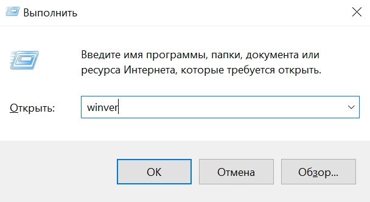
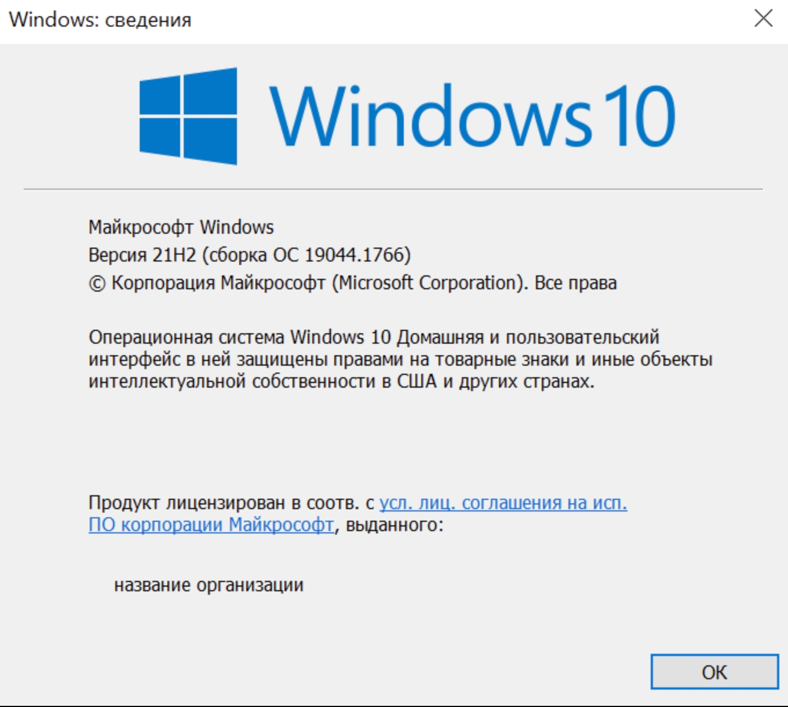
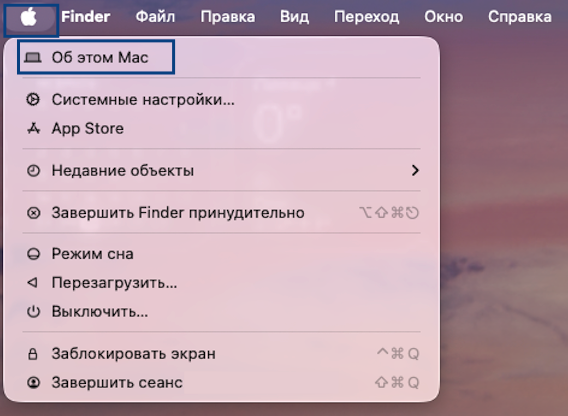
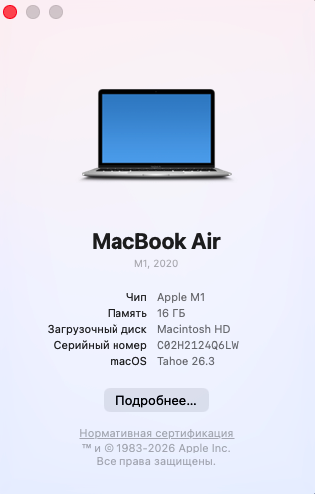

Чтобы посмотреть версию операционной системы на Windows и MacOS выберете соответствующий раздел:

[tabs]

[tab:Windows 8.1 - 11]

1. Чтобы узнать, какая версия Windows используется на вашем устройстве, нажмите **клавишу с логотипом Windows** + **R**, введите **winver** в поле **Открыть.**

   {width=608px height=333px}

2. Нажмите **ОК**.

   {width=1360px height=1222px}

[/tab]

[tab:MacOS]

Чтобы узнать, какая версия MacOS используется на вашем устройстве, в **меню Apple** в углу экрана выберите **пункт «Об этом Mac»**.

{width=568px height=416px}

Вы увидите название выпуска macOS, например macOS Monterey или macOS Big Sur, и номер версии. Если необходимо также узнать номер сборки, для его отображения щелкните номер версии.

{width=315px height=494px}

[/tab]

[/tabs]