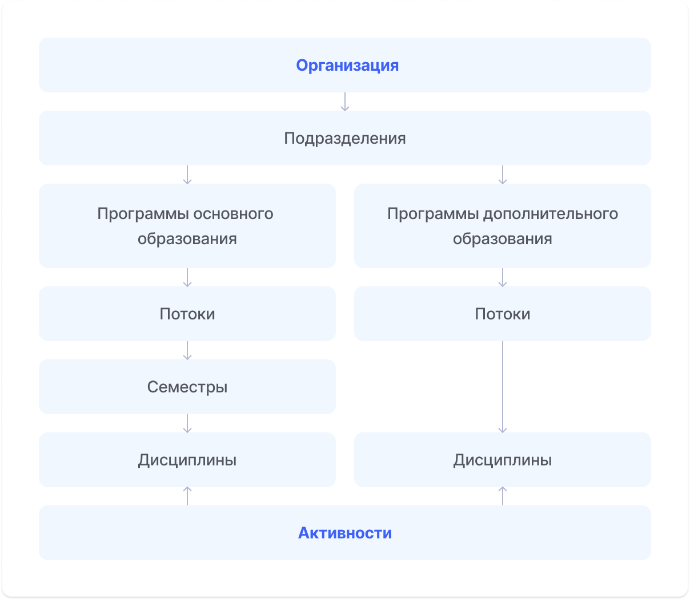

# 👋 Знакомство

## Как проходит обучение?



* откройте [**Дашборд**](dashbord.md)&#x20;
* познакомьтесь с системой Odin
* изучите информацию о программе - это может быть отдельная дисциплина или раздел в основной дисциплине.
* переходите к обучению.&#x20;


Для успешного прохождения обучения необходимо:

* посещать Активности, проходящие в онлайн-формате;
* нажимать кнопку "[Завершить активность](../kak-zavershit-aktivnost.md)", после изучения материала, во всех синхронных и асинхронных активностях, в том числе, если активность проводилось в формате видеозвонка;
* &#x20;выполнять задания и проходить тесты в установленные сроки.


<figure><figcaption>
Структура системы
</figcaption></figure>


**Активность** - аналог занятия в университете: лекции, практики, контрольные и др.

