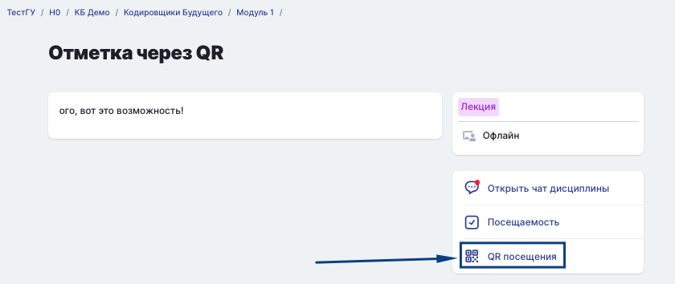

## Отметка посещаемости на онлайн-занятиях

**Если звонок (вебинар) проходит в Odin** отметка посещаемости будет поставлена автоматически. 

**Если звонок (вебинар) проходит на сторонней платформе**, то преподаватель проставит отметку о посещаемости вручную.

Если в активности доступна кнопка «Завершить активность», надо её нажать. При этом процент просмотра видео должен быть не менее 80, иначе завершить активность не получится.

{width=778px height=704px}

## **Отметка посещаемости на офлайн-занятиях**

1\.Перед началом занятия надо через мобильное приложение или веб-версию сайта открыть страницу занятия, кликнуть на три точки в верхнем правом углу и нажать «QR посещения».

{width=270px height=499px}

2\.Сформируется уникальный QR-код, действующий только для данного занятия и данного студента. Срок его действия составляет 3 минуты.

{width=283px height=528px}

3\.Надо показать данный код преподавателю для сканирования.

4\.При успешном сканировании автоматически проставляется отметка посещаемости за данное занятие.

