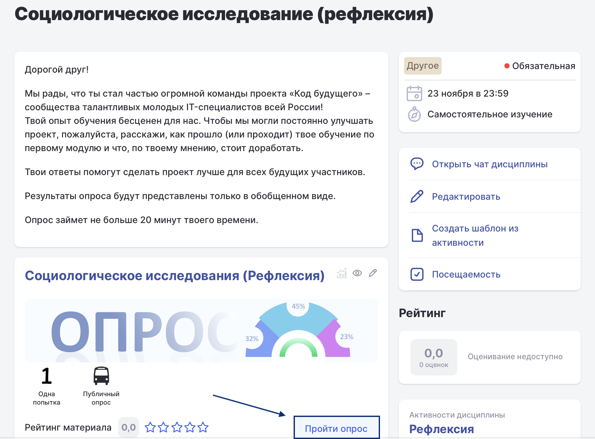

**Рефлексия -- это небольшой опрос**, в котором вы можете оценить, как проходит ваше обучение: что было понятным и полезным, а что можно улучшить.

**Зачем это нужно?**\
Ваши ответы помогут:

-  **Оценить качество курса** и удобство обучения.

-  **Выявить сильные и слабые стороны** программы.

-  **Разработать улучшения** для следующих потоков студентов.

**Как устроена рефлексия?**

-  **Сроки:** Пройти опрос можно во время или после завершения 1 модуля.

-  **Формат:** Опрос состоит из **13 вопросов**.

-  **Содержание:** Вопросы касаются вашего впечатления от курса и предложений по его улучшению. Также есть общие вопросы (например, о вашем регионе) для более точного анализа.

-  **Прохождение:** Ответить нужно на все вопросы. В некоторых случаях требуется выбрать один вариант, в других -- несколько.

-  **Время:** На прохождение потребуется **не более 20 минут**.

**Как пройти опрос?**

1. Перейдите в дисциплину «Рефлексия».

2. Откройте одноименную активность.

3. Нажмите кнопку **«Пройти опрос»**.

4. Ответьте на все вопросы.

5. В конце нажмите **«Завершить»**, чтобы отправить свои ответы.

   {width=1832px height=1354px}