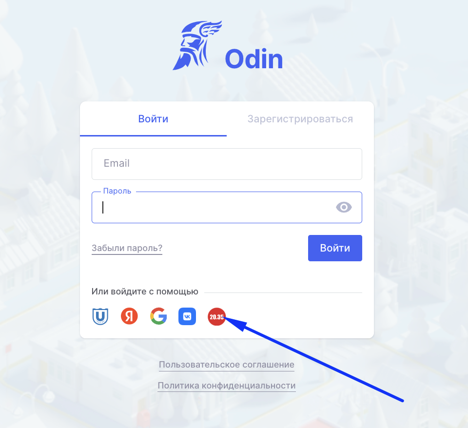
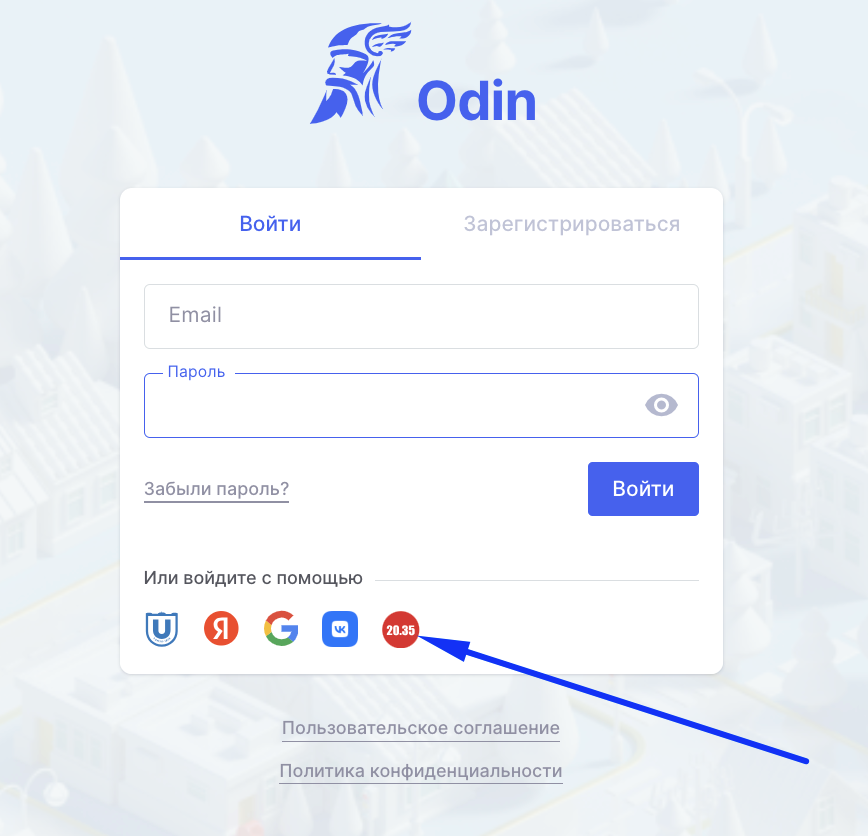

Все заявки на участие в проекта необходимо подавать на портале У2035, после подачи заявки вам предложат пройти вступительное испытание и по его результатам зачислят на соответствующий уровень.

После зачисления вы сможете в приступить к обучению. Помимо обучения вам необходимо будет оформить договор на обучение и согласие на обработки персональных данных с вашей образовательной организацией.

Путь 1. Для участников проекта «Код будушего», кто будет обучаться в  **Центре развития профессиональных компетенций Республики Татарстан** или в **Томском государственном университете** оформление документов будет происходить **в системе** **Flow.**

Путь 2. Для участников проекта «Код будушего» в **АНО ДПО**  **МЦК «Цель»** процесс оформления документов на зачисление организация определит и сообщит вам самостоятельно.

[tabs]

[tab:Путь 1]

Шаг 1. Войдите в [ЛК Flow](https://lk.flow-crm.study/Cabinet/Login)  после того, как получите письмо от  отправителя [info@flow-crm.study](mailto:info@flow-crm.study) (письмо вы получите как только заявку после вступительного испытания одобрят в У2035 и она попадет во Flow ). В письме будет ссылка на вход. Обратите внимание, что ссылка действует сутки, потом необходимо будет запросить новую, чтобы продолжить работу в ЛК, запросить новую ссылку можно  в [ЛК Flow](https://lk.flow-crm.study/Cabinet/Login) , указав свою почту из заявки.

Шаг 2. Последовательно заполняйте все поля во Flow. Когда вы отправите на проверку документы, то придется немного подождать. Документы в рабочем порядке проверят сотрудники вашей организации и после  успешной проверки  откроется следующий шаг.

Шаг 3. В день старта обучения вне зависимости от того прошли ли вы весь процесс до зачисления или пока находитесь в процессе (процесс в любом случае необходимо будет завершить, даже если вы уже начали учиться), вам на почту поступит письмо от Odin и вы сможете приступить к обучению.

:::danger 

Важно! После получения этого письма входите в Odin <https://www.odin.study/ru/Account/Login>, используя вход через У2035

:::

{width=960px height=878px}

[/tab]

[tab:Путь 2]

После того, как вы пройдёте Вступительное испытание, образовательная команда вашей организации сформирует файл со списком обучающихся и импортирует его в Odin.  Сразу после импорта вам на почту придет информативное письмо от Odin.

:::danger 

Важно! После получения этого письма входите в Odin <https://www.odin.study/ru/Account/Login>, используя вход через У2035

:::

{width=868px height=836px}

[/tab]

[/tabs]

