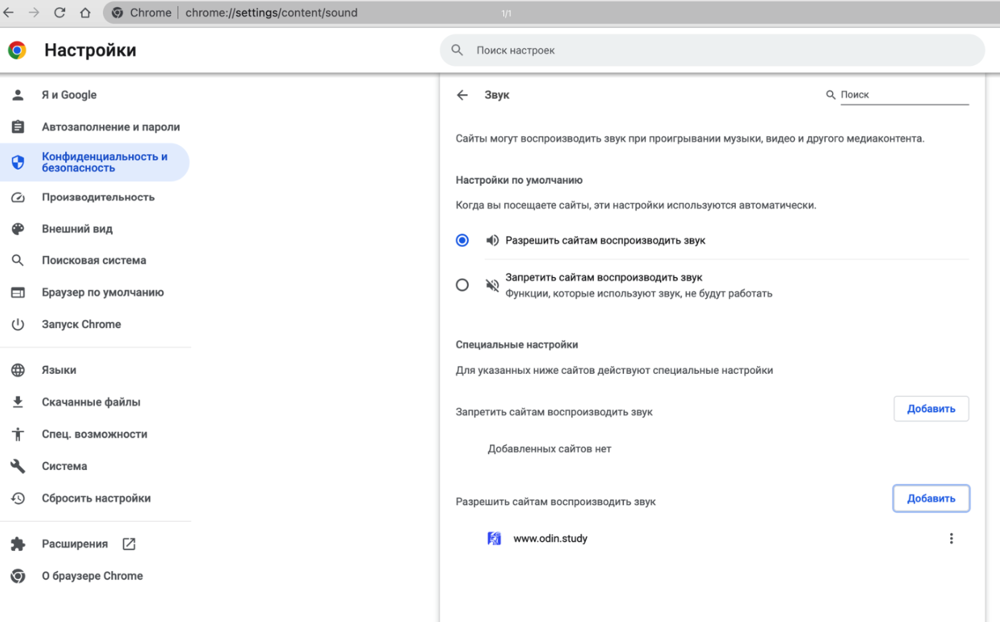
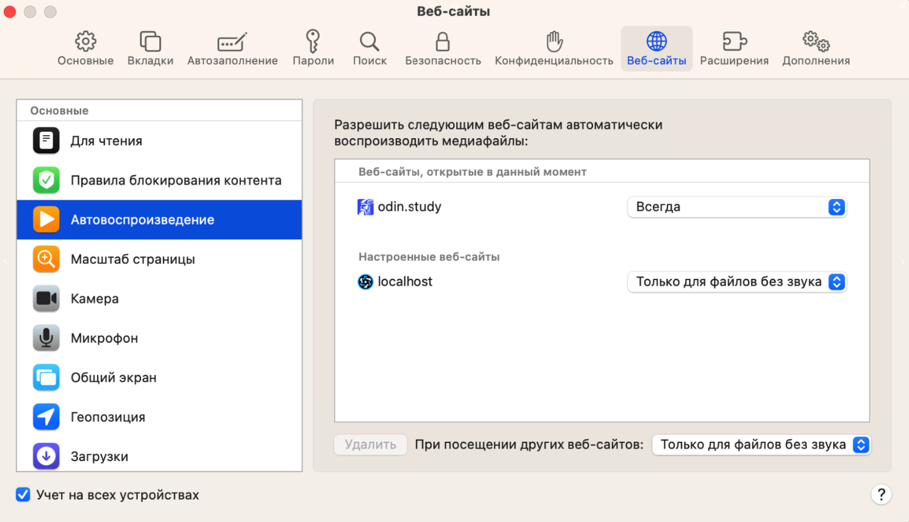
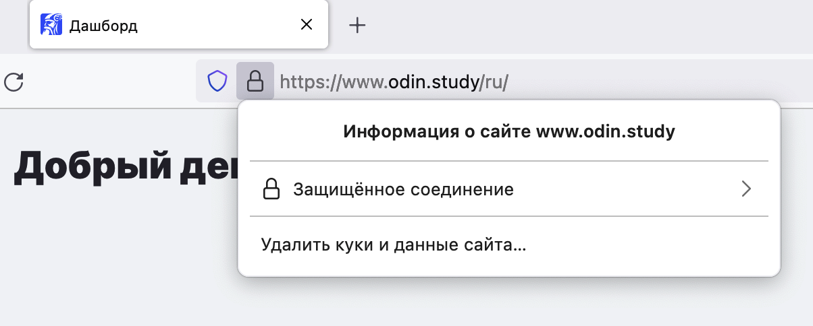
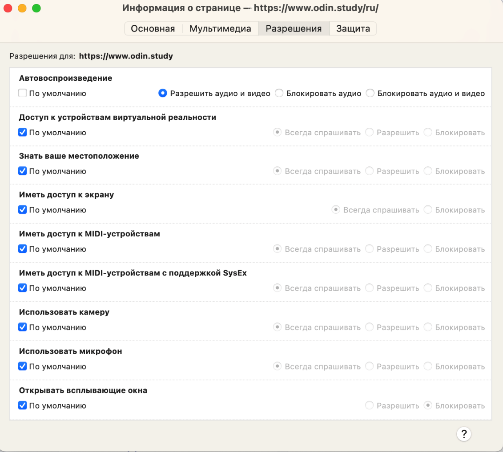

:::info 

В настоящее время веб-браузеры переходят к более строгим политикам автоматического воспроизведения, чтобы улучшить взаимодействие с пользователем и предоставить больший контроль над воспроизведением медиафайлов.

\
Поэтому веб-браузеры могут блокировать автовоспроизведение аудио, если пользователь какое-то время никак не взаимодействовал со страницей. Это может быть причиной того, что в звонке не слышно какого-то пользователя (или всех), так как браузер посчитал необходимым заблокировать воспроизведение аудио на этой странице.

:::

Чтобы таких ошибок не возникало, следует добавить сайт [www.odin.study](http://www.odin.study/) в исключения, тогда браузер не будет блокировать воспроизведение аудио на страницах Odin.

[tabs]

[tab:Как это сделать в Google Chrome]

Следует открыть настройки браузера, в настройках выбрать раздел «Конфиденциальность и безопасность», далее выбрать «Настройки сайтов» - «Дополнительные настройки контента» - «Звук». На открывшейся странице в разделе "Разрешить сайтам воспроизводить звук" нажать на кнопку "Добавить" и добавить сайт [www.odin.study](http://www.odin.study)[](http://www.odin.study/), как показано на скриншоте:

{width=1506px height=937px}

[/tab]

[tab:Как это сделать в Safari]

Следует открыть настройки браузера, далее выбрать раздел «Веб-сайты» - «Автовоспроизведение» и напротив сайта [www.odin.study](http://www.odin.study)[](http://www.odin.study/) в выпадающем списке выбрать «Всегда».

{width=1502px height=865px}

Чтобы сайт [www.odin.study](http://www.odin.study)[](http://www.odin.study/) отображался в этих настройках, необходимо сначала открыть его во вкладке и уже потом открывать настройки.

[/tab]

[tab:Как это сделать в Firefox]

Для этого необходимо открыть сайт [www.odin.study](http://www.odin.study)[](http://www.odin.study/), нажать на иконку замочка в адресной строке, после этого появится окно:

{width=1204px height=484px}

Далее надо нажать на «Защищенное соединение» и в появившемся окне выбрать «Подробнее». Откроется окно, в котором выбирается раздел «Разрешения». В разделе «Автовоспроизведение» следует снять галочку «По умолчанию» и выбрать настройку «Разрешить аудио и видео» как показано на скриншоте:

{width=1131px height=1019px}

[/tab]

[/tabs]