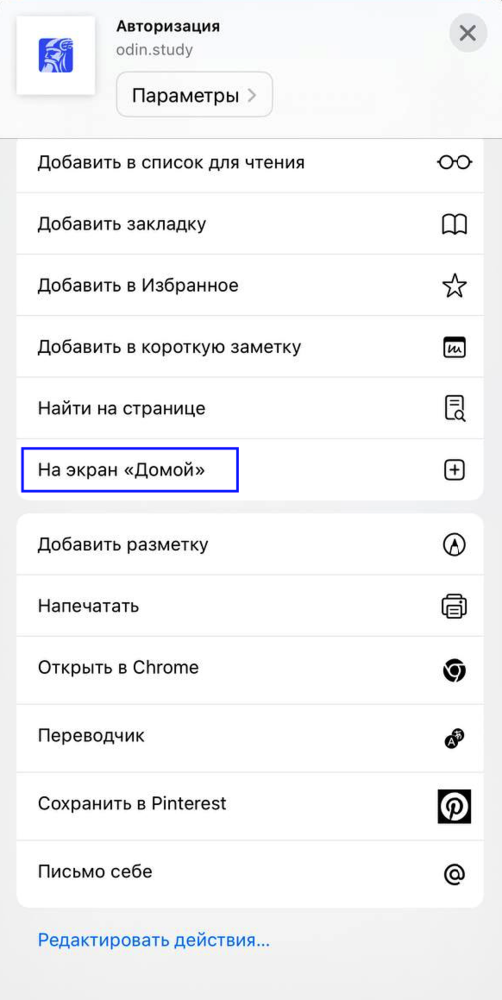

В зависимости от ОС телефона можете выбрать установки приложения Odin

## IOS

Odin **нет** в AppStore, но вы можете установить PWA - **приложение** для SPA на мобильной версии **через браузер**:

1. Зайдите в браузер Safari

2. Меню браузера нажмите на {width=70px height=66px}

   {width=583px height=1274px}

3. Выберите пункт “На экран Домой”

   {width=582px height=1159px}

4. Нажмите кнопку “Добавить”

   {width=577px height=368px}

5. PWA - приложение для SPA установлено на экран вашего телефона

   {width=583px height=286px}

6. 6