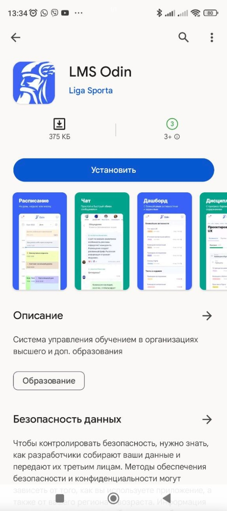
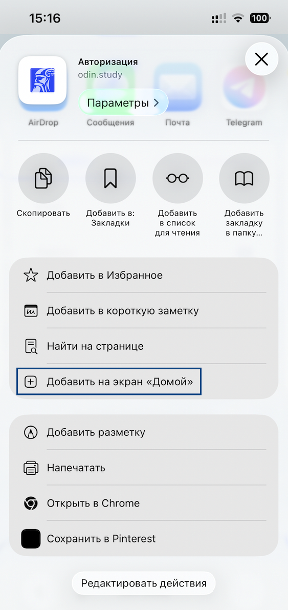
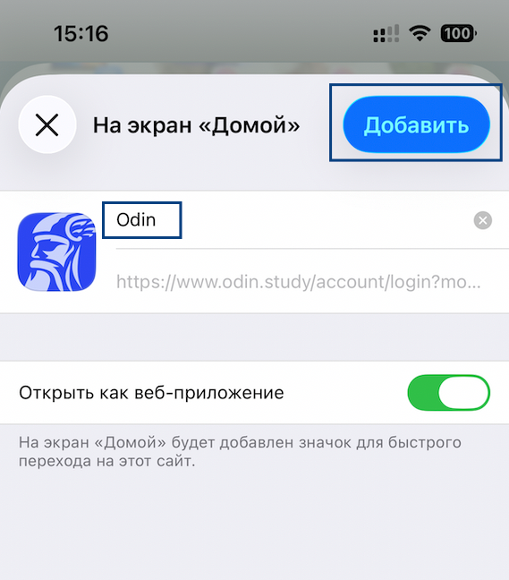
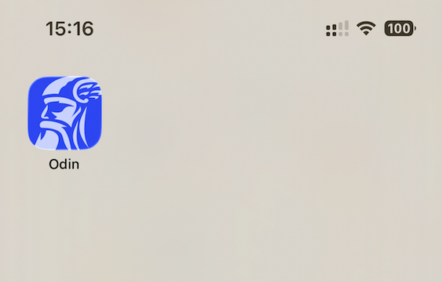

В зависимости от ОС телефона можете выбрать тот или иной вариант установки приложения Odin

[tabs]

[tab:На смартфоне Android]

Опубликовано приложение Odin в [Google Play](https://play.google.com/store/apps/details?id=study.odin.www.twa)

{width=560px height=1254px}

[/tab]

[tab:На IPhone]

Odin **нет** в AppStore, но вы можете установить PWA - **приложение** для SPA на мобильной версии **через браузер**:

Зайдите в браузер Safari

В меню браузера нажмите на три точки в правом нижнем углу и потом «Поделиться»:

{width=566px height=1229px}

Выберите пункт “Добавить на экран Домой”.

{width=563px height=1191px}

Назовите иконку, нажмите кнопку “Добавить”.

{width=569px height=648px}

PWA - приложение установлено на экран вашего телефона.

{width=563px height=360px}

[/tab]

[/tabs]