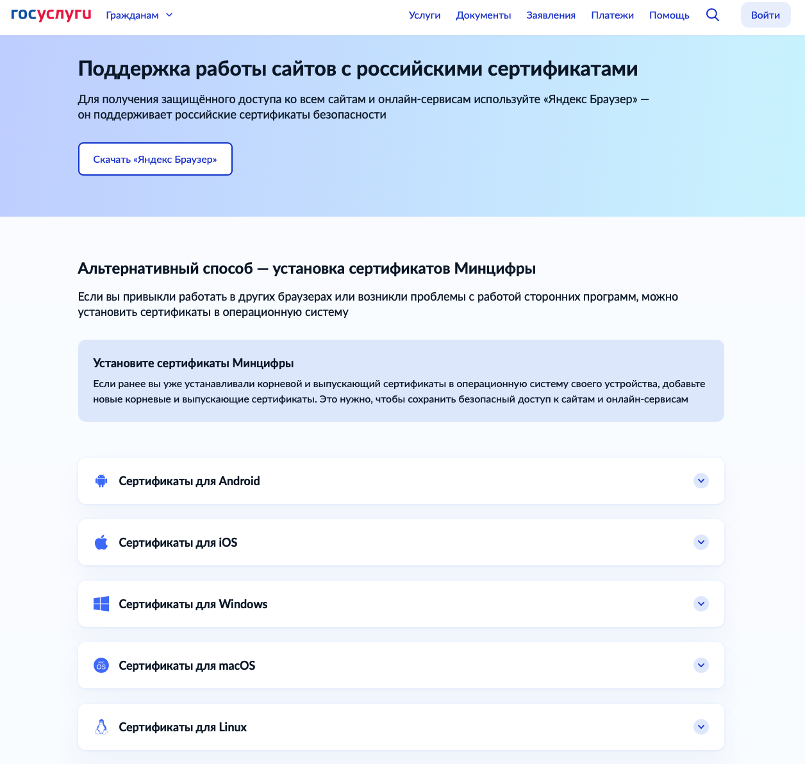

Иногда случается так, что при использовании Яндекс.Браузера или Chromium Gost у пользователей наблюдается ошибка с входом. Это связано с шифрованием данных. Обычно ошибка возникает, если установлен сертификат КриптоПРО старой версии.

Для того, чтобы ошибки входа не мешали работе и учебе, надо сразу нажать «Продолжить» на вот таком предупреждении при входе. Это не ошибка, а просто предупреждение о том, что используется российский метод шифрования.

{width=883px height=355px}

Если вдруг ошибка сохраняется, тогда надо установить корневой сертификат Минцифры с сайта <https://www.gosuslugi.ru/crt> . Для удобства пользователей там содержится видеоинструкция по установке.

{width=1256px height=1192px}

Устанавливать следует именно корневые сертификаты, а не выпускающие (от них не будет вреда, но для входа они не потребуются).

В некоторых случаях может потребоваться обновление КриптоПро до последней версии.