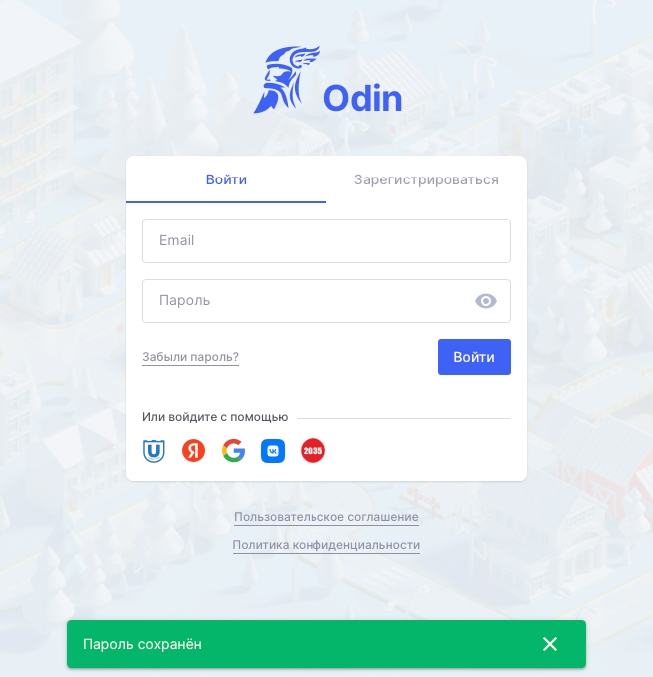

В системе предусмотрена возможность изменения пароля.

:::info 

**Ссылка для входа в Odin:** <https://www.odin.study/ru/Account/Login>

:::

**Смена пароля может потребоваться в следующих случаях:**

[tabs]

[tab:Если пользователь совсем его не помнит/не знает]

Зайдите на [страницу авторизации Один](https://odin.study/ru/Account/Login/) и нажмите "Забыли пароль".​

{width=550px height=583px}

Введите email, с которым зарегистрированы в программе, отметьте галочку "Я не робот" и нажмите "Отправить".​

{width=900px height=468px}

Войдите в указанную почту, найдите письмо от нас (адрес отправителя [noreply@odin.study](mailto:noreply@odin.study)) и нажмите ссылку.​

{width=900px height=615px}

Придумайте свой пароль и повторите его. Отметьте галочку и нажмите кнопку "Восстановить".​

{width=900px height=687px}

Появится сообщение "Пароль успешно восстановлен". После такого сообщения введите свои email и пароль. Нажмите кнопку "Войти".​

{width=653px height=677px}

Вы снова в системе Odin!​

{width=900px height=480px}

[/tab]

[tab:Если пользователь находится в системе и знает свой пароль]

Если пользователь находится в системе и знает свой пароль, то он может его поменять. Для этого необходимо перейти на страницу своего профиля и в меню выбрать кнопку Изменить пароль.

{width=900px height=450px}

В открывшемся окне необходимо ввести текущий пароль, новый пароль, продублировать новый пароль, а далее нажать на кнопку "Сохранить" в правом нижнем углу страницы.

{width=900px height=664px}

[/tab]

[tab]

[/tab]

[tab]

[/tab]

[/tabs]